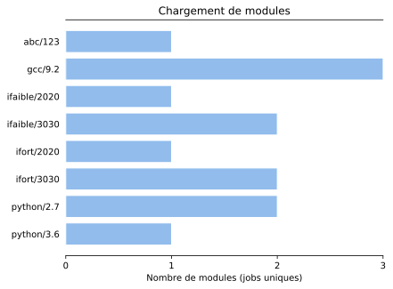

# cogniva

cogniva is a python script written to parse system log files
and report which environment modules were loaded and how many times
each one was loaded. cogniva has a low memory footprint and can parse
several files simultaneously using several cpus, which is ideal for cluster
environments.

## tldr

```
git clone https://github.com/epfl-scitas/cogniva
cd cogniva
source install.sh
cogniva
```

## Configuration

cogniva uses a configuration file (`cogniva.conf`) which provides information about where to look for logs, which sub-directories to search and which files to read.

- `log_path` - cogniva will look for log files in this directory and all sub-directories.
- `patterns` - This field actually accepts regular expressions (python compatible). As an example, cogniva can search only compressed files if the following regex `filename[\S]gz` is used.

cogniva was designed to run in a cluster environment. As such, there can be hundreds or thousands of sub-directories where to look for logs. cogniva assumes these sub-directories have a naming mechanism which can be seen as `prefix` + `nodes`.

- `prefix` - Prefix for the nodes, usually the first letters of the cluster name.
- `nodes` - Usually a cluster has different type of nodes. Can accept multiple values separated by commas.
 
If both of these two fields are left empty, cogniva will search for files under the directory given by log_path and all its sub-directories.
 
cogniva will look for the configuration file in `.cogniva` under the user home directory and then in the `/etc` directory.

## Installation

After having cloned the repository the `install.sh` script should be sourced. This will update the `PATH` and `PYTHONPATH` variables with the location of cogniva files.

In case it is the first time you are using cogniva, this script will also create a dummy configuration file under `.cogniva` in the users home directory. This out-of-the-box configuration sets up cogniva to run against two log files which are given in the sample directory.

## Getting started

The `cogniva` command will create a csv file (in the same directory where the command was issued) and also a horizontal bar graph relating the data found in the csv file.

With the out-of-the-box configuration (i.e., cogniva.conf points to the sample directory) the following data can be seen:

```
abc/123,1
gcc/9.2,3
ifaible/2020,1
ifaible/3030,2
ifort/2020,1
ifort/3030,2
python/2.7,2
python/3.6,1
```




## Use cases

    $ cogniva

The standard behaviour is to count the number of modules found in distinct jobs. 

    $ cogniva -group cat
    
The `-group cat`option tells cogniva to group the results by module category. That is, the name of the module or the string that preceds the version of the module.

    $ cogniva -group path
    
When grouping by the modules path, only the first directory of the path is considered.

    $ cogniva -uniq users

Other than counting the number of module across different jobs, cogniva can also count the number of modules loaded by diferent users. The report file created with this option also lists the users that loaded the module.

    $ cogniva -uniq users -group cat

As before, modules can be grouped in categories, also when the different users paradigm is in use.

    $ cogniva -uniq users -group path
    
Grouping by path is also available when counting unique users.

## Filter options

    -start yyyymmdd

When start parameter is specified, cogniva will only retain system log entries whose date is AFTER the given parameter.
If desired, this parameter will also accept the time passed immediately after the date (no space between) in hhmmss format.

    -end yyyymmdd
    
If specified, cogniva will only retain system log entries whose date is BEFORE the given parameter.
If desired, this parameter will also accept the time passed immediately after the date (no space between) in hhmmss format.

    -module <module1> <module1>
    
A list of modules can be given to cogniva. As expected cogniva will check if the modules found in the logs belong to this list before updating the counts.
    
## Other options
    
    -cpus n
    
By default, cogniva will take up to 75% of the existing cores. This behaviour can be changed by explicitly giving the number od cores to be used with the `-cpus` parameter. No need to say, don't run cogniva with more cores than you have.

    -verbose
    
Can be usedfull, who knows?

    -chart-color <hex-value, no pound sign>
    
Faishon is always changing. Try to keep up!
    
## Authors

EPFL SCITAS

## License

cogniva is distributed under the terms of the GPL v3 licence.
